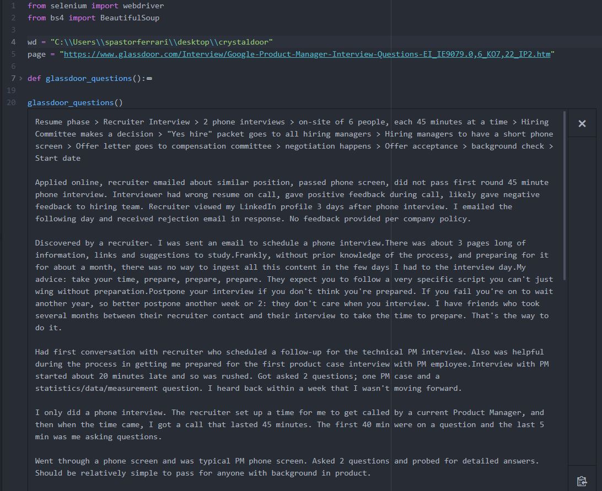

# crystaldoor
## sebastian pastor ferrari 2020 © - for reference only
Script that allows you to input a Glassdoor link and extract every job application interview question.

#### Requirements:
* BeautifulSoup
* Firefox Webdriver

#### How to use:
* Step 01: Paste your working directory into "YOUR_WORKING_DIRECTORY_HERE". Your wd should be the folder with your script & webdriver.
* Step 02: Paste the link of the specific page that you want to scrape into "GLASSDOOR_LINK_HERE".
* Step 03: GO!

